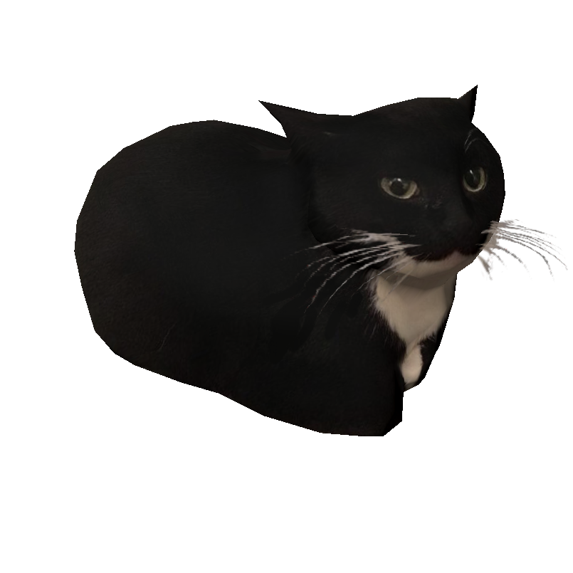

# 🐱 Maxwell — The Desktop Cat

> **Maxwell the carryable cat**, now living on your KDE Plasma desktop.

[](https://kde.org)



## ✨ Features

- **Two display modes** — Choose between a classic animated GIF or a smooth 3D mesh rendering.
- **Mouse-controlled camera** — In 3D Mesh mode, drag to orbit the camera around Maxwell and scroll to zoom.
- **Customizable animation** — Swap in your own GIF or 3D mesh (GLB) and adjust playback/rotation speed.
- **Theme song** — Play the iconic Maxwell theme song (or any audio file) on click or double click.
- **Fully configurable** — Adjust speed, enable mirroring, control rendering quality, and more.

## 🚀 Installation

The easiest way to install Maxwell is via the [KDE Store](https://store.kde.org/p/2274580):

Right-click on your Plasma desktop → **Add Widgets** → search for **Maxwell** → **Install**

## ⚙️ Configuration

Right-click the Maxwell widget and select **Configure...** to access all settings, including display mode, paths, speed, and sound options.

## ⚠️ Requirements

- **KDE Plasma 6.0** or later.
- **QtQuick3D** & **Assimp Plugin**: Both are required if you want to use the **3D Mesh** display mode. Install them via your distribution's package manager:
  - **Arch Linux / Manjaro:** `qt6-3d` and `qt6-assimp`
  - **Fedora:** `qt6-qtquick3d` and `qt6-qtquick3d-assets`
  - **openSUSE:** `libqt6qtquick3d` and `libqt6qtquick3d-assets`
  - **Debian / Ubuntu:** `libqt6qtquick3d6` and `libqt6qtquick3d6-assets`

## 🛠️ Building & Testing

To package the widget for distribution, run `./build.sh` (requires `jq` and `tar`).
To run unit tests, execute `./tests/run_tests.sh` (requires `qmltestrunner-qt6`).

## ⚠️ Known Issues

- **Adding the widget to the taskbar in 3D Mesh mode** requires a Plasmashell restart. After adding the widget to the taskbar while in 3D Mesh mode, either log out and back in, or run:
  ```bash
  plasmashell --replace
  ```
- **Adjusting the widget width in 3D Mesh mode** will not grow or shrink the 3D model. The model size remains fixed regardless of widget width adjustments.

## 🤖 About This Project

Maxwell is **vibe-coded** — built collaboratively with AI (Claude Code), with a human steering the design, testing, and final calls. If something looks a little AI-flavored under the hood, now you know why.

## 🐛 Reporting Issues

Found a bug or have a feature request? Please open an issue on [GitHub](https://github.com/wilversings/maxwell/issues).
